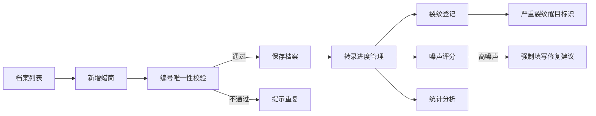

## 1. 产品概述

蜡筒录音档案管理系统，面向音像资料馆的档案管理员与音频修复师，用于系统化管理蜡筒录音藏品的物理状态、转录进度与修复记录。系统通过结构化数据记录与可视化统计，提升档案整理效率与修复决策质量。

## 2. 核心功能

### 2.1 用户角色

| 角色 | 登录方式 | 核心权限 |
|------|----------|----------|
| 档案管理员 | 系统登录 | 蜡筒档案增删改查、转录进度管理、状态筛选 |
| 音频修复师 | 系统登录 | 噪声评分、裂纹登记、修复建议填写、统计查看 |

### 2.2 功能模块

1. **蜡筒档案列表**：数据表格展示、多维度筛选、搜索、新增/编辑/删除
2. **详情抽屉**：蜡筒完整信息展示、裂纹记录、修复建议、转录进度编辑
3. **图表统计**：年代分布柱状图、转录完成率饼图、噪声等级占比玫瑰图
4. **转录任务管理**：按进度筛选、批量状态更新
5. **裂纹登记**：严重程度分级、位置描述、醒目标识
6. **噪声评分**：等级评定、修复建议关联

### 2.3 页面详情

| 页面名称 | 模块名称 | 功能描述 |
|----------|----------|----------|
| 档案管理页 | 顶部工具栏 | 搜索框、状态筛选器、新增按钮、导出按钮 |
| 档案管理页 | 数据表格 | 蜡筒编号、标题、年代、材质状态、保存位置、转录进度、噪声等级、当前状态、操作列 |
| 档案管理页 | 分页控件 | 分页切换、每页条数选择 |
| 详情抽屉 | 基本信息区 | 蜡筒核心字段展示与编辑 |
| 详情抽屉 | 裂纹记录区 | 裂纹列表、新增裂纹、严重程度标识 |
| 详情抽屉 | 修复建议区 | 修复建议编辑、高噪声强制填写校验 |
| 统计分析页 | 年代分布图 | 各年代蜡筒数量柱状图 |
| 统计分析页 | 转录完成率 | 已完成/进行中/未开始占比饼图 |
| 统计分析页 | 噪声等级占比 | 各噪声等级分布玫瑰图 |

## 3. 核心流程

### 3.1 蜡筒档案录入流程
管理员新增蜡筒 → 填写基本信息（编号唯一校验）→ 保存 → 自动进入"待转录"状态

### 3.2 转录进度更新流程
选择蜡筒 → 打开详情抽屉 → 调整转录进度(0-100) → 达到100%可标记"已归档"

### 3.3 裂纹登记流程
打开蜡筒详情 → 新增裂纹记录 → 选择严重程度 → 填写位置描述 → 保存（严重裂纹醒目提示）

### 3.4 噪声评分与修复建议流程
评定噪声等级 → 若为高噪声 → 强制填写修复建议 → 保存

## 4. 用户界面设计

### 4.1 设计风格

- **主色调**：深棕色系（#5D4037、#795548），呼应蜡筒的历史质感与木质材料属性
- **点缀色**：古铜金（#B8860B），用于重点数据与交互元素
- **背景色**：米白与浅褐色渐变，营造档案管理的专业氛围
- **字体**：标题使用衬线字体（Playfair Display）增强历史感，正文使用无衬线字体（Noto Sans SC）保证可读性
- **卡片风格**：圆角 8px，微阴影，轻微纹理质感
- **图标风格**：线性图标，复古色调

### 4.2 页面设计概览

| 页面名称 | 模块名称 | UI 元素 |
|----------|----------|---------|
| 档案管理页 | 顶部导航 | Logo、页面标题、统计页签切换 |
| 档案管理页 | 筛选工具栏 | 搜索输入框、状态下拉选择、年代区间筛选 |
| 档案管理页 | 数据表格 | 斑马纹行、悬停高亮、严重裂纹行红色边框提示 |
| 档案管理页 | 操作列 | 查看详情、编辑、删除图标按钮 |
| 详情抽屉 | 抽屉面板 | 右侧滑入，半透明遮罩，顶部关闭按钮 |
| 详情抽屉 | 标签页 | 基本信息、裂纹记录、修复建议 |
| 统计分析页 | 图表卡片 | 三栏等高卡片布局，每个图表配标题与数据说明 |
| 统计分析页 | 概览指标 | 顶部统计数字卡片（总数、已转录、待修复） |

### 4.3 响应式设计

- 桌面端优先（1280px 以上），三栏图表布局
- 平板端（768-1279px），图表改为两栏布局
- 移动端（768px 以下），图表单列堆叠，表格改为卡片列表

### 4.4 动效与交互

- 抽屉滑入/滑出过渡动画（300ms ease）
- 表格行悬停背景色过渡
- 图表数据加载入场动画（Nivo 原生）
- 严重裂纹行呼吸灯效果提示
- 按钮点击波纹效果（MUI 原生）
