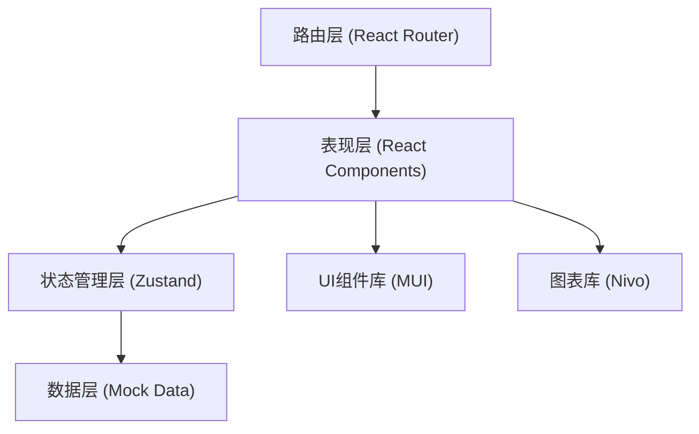

## 1. 架构设计



## 2. 技术描述

- **前端框架**：React 18 + TypeScript
- **构建工具**：Vite
- **UI 组件库**：Material UI (MUI) v5
- **图表库**：@nivo/bar、@nivo/pie、@nivo/radar
- **状态管理**：Zustand
- **路由**：React Router DOM v6
- **样式方案**：MUI 主题定制 + CSS-in-JS (emotion)
- **图标**：@mui/icons-material
- **数据持久化**：localStorage（本地存储）

## 3. 路由定义

| 路由 | 页面 | 说明 |
|------|------|------|
| / | 蜡筒档案列表 | 主页面，含筛选与表格 |
| /statistics | 统计分析 | 图表统计页面 |

## 4. 数据模型

### 4.1 数据模型定义

```mermaid
erDiagram
    CYLINDER ||--o{ CRACK : "有
    CYLINDER {
        string id "蜡筒编号(唯一)
        string title "录音标题"
        number year "年代"
        string materialStatus "材质状态"
        string storageLocation "保存位置"
        number transcriptionProgress "转录进度0-100"
        string noiseLevel "噪声等级"
        string currentStatus "当前状态"
        string repairSuggestion "修复建议"
        date createdAt "创建时间"
    }
    CRACK {
        string id "裂纹ID"
        string cylinderId "关联蜡筒编号"
        string severity "严重程度"
        string location "位置描述"
        string description "详细描述"
        date discoveredAt "发现日期"
    }
```

### 4.2 枚举定义

- **材质状态**：完好 / 轻微磨损 / 严重磨损 / 破损
- **噪声等级**：低 / 中 / 高 / 严重
- **当前状态**：待转录 / 转录中 / 已完成 / 已归档 / 待修复
- **裂纹严重程度**：轻微 / 中等 / 严重

### 4.3 业务规则校验

1. 蜡筒编号唯一性校验：新增/编辑时校验编号不重复
2. 转录进度范围：0-100 整数
3. 归档校验：未完成转录（进度 < 100）不能标记为"已归档"
4. 高噪声修复建议必填：噪声等级为"高"或"严重"时，修复建议字段必填
5. 严重裂纹标识：列表中严重裂纹蜡筒行红色边框醒目标识

## 5. 项目结构

```
src/
├── components/          # 可复用组件
│   ├── CylinderTable.tsx     # 蜡筒数据表格
│   ├── CylinderDrawer.tsx  # 详情抽屉
│   ├── CylinderForm.tsx    # 蜡筒表单
│   ├── CrackList.tsx      # 裂纹列表
│   ├── FilterBar.tsx      # 筛选工具栏
│   └── StatCard.tsx       # 统计卡片
├── pages/               # 页面组件
│   ├── CylinderList.tsx    # 蜡筒档案列表页
│   └── Statistics.tsx      # 统计分析页
├── store/               # 状态管理
│   └── useCylinderStore.ts # 蜡筒状态store
├── types/               # TypeScript 类型定义
│   └── index.ts           # 类型与枚举
├── data/                # Mock 模拟数据
│   └── mockData.ts      # 初始示例数据
├── utils/               # 工具函数
│   └── validators.ts    # 业务规则校验
│   └── formatters.ts    # 格式化函数
├── theme/               # MUI 主题配置
│   └── index.ts
├── App.tsx
├── main.tsx
└── index.css
```

## 6. 核心技术要点

### 6.1 状态管理设计

使用 Zustand 管理全局状态：
- 蜡筒列表数据
- 当前筛选条件
- 当前选中蜡筒
- 抽屉打开/关闭状态
- 编辑模式

### 6.2 MUI 主题定制

- 自定义调色板：棕色主色调、古铜金强调色
- 自定义排版：衬线标题字体 + 无衬线正文字体
- 自定义组件样式：表格、抽屉、按钮等

### 6.3 Nivo 图表配置

- **柱状图（年代分布）：水平柱状图，棕色渐变填充
- **饼图（转录完成率）：环形饼图，自定义图例
- **雷达图/玫瑰图（噪声等级占比）：极坐标图

### 6.4 表单校验

- 使用 MUI TextField + 自定义校验逻辑
- 实时校验：编号重复检查、进度范围检查
- 提交前校验：归档状态检查、高噪声修复建议检查
